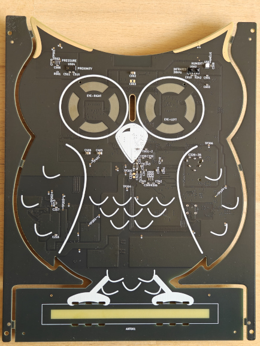
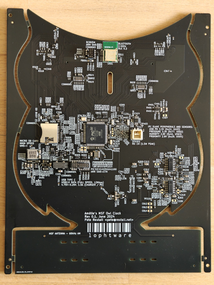

# MSF Owl Clock
 

The above images are the boards as delivered from fabrication, not the end product.  Namely:
* The edge / tool rails need to be cut off to leave only the owl-shaped board
* A ferrite rod antenna (and tuning capacitors) need to be attached, creating a branch on which the owl perches (yellow tie-wraps for talons)
* Two TFT displays need to be secured in place for the eyes
* A base / stand needs to be 3D printed, which will also hold a speaker and its cavity

This project is a desk clock intended to synchronise with the [60kHz AM MSF](doc/datasheets/msf/msf.pdf) time signal that is broadcast by the UK's NPL using their [Anthorn Radio Station in Cumbria, England](https://www.npl.co.uk/msf-signal).

The [board schematics](src/schematics/msf-owl-clock.pdf) and [PCB fab files](src/pcb-fab/) were created in KiCAD.  [Firmware](src/firmware/) will, no doubt, be a very long-running part of the project (as usually seems to happen...)

The board consists of:
* A [PIC32CX1025SG41100](doc/datasheets/mcu/PIC32CX1025SG41100-datasheet-DS60001715.pdf) ARM Cortex M4F:
  * M-profile ARM v7 CPU running up to 120MHz
  * 1MiB flash
  * 256KiB SRAM
  * 8KiB backup SRAM
  * 1Msps 12-bit ADC
  * 1Msps 12-bit DAC
* Two multiplexed QSPI [360x360 Circular TFTs](doc/datasheets/tft/buydisplay-ER-TFT1.32-1.pdf) for the eyes
* A USB Type-C connector with USB PD / charger detection and USB2.0 Full Speed data
* A Micro SD Card connector
* An [IS31AP4991A](doc/datasheets/opamps/IS31AP4991A-SLS2-TR.pdf) audio amplifier / speaker driver (the speaker and cavity will be built into a 3D-printed base / stand)
* A [BC805M](doc/datasheets/bluetooth/BC805M.pdf) 2.4GHz Bluetooth / BLE 5.2 Module running an [nRF52805](doc/datasheets/bluetooth/nRF52805_PS_v1.4.pdf) ARM Cortex M4
* A range of I2C sensors:
  * A [DPS310XTSA1](doc/datasheets/sensors/pressure/DPS310XTSA1.pdf) Pressure Sensor to create a barometer
  * A [HDC3022](doc/datasheets/sensors/humidity/HDC3022.pdf) Humidity Sensor for measuring humidity and temperature
  * A [VL6180V1NR](doc/datasheets/sensors/proximity/VL6180V1NR-1.pdf) Proximity Sensor to allow power-saving mode when nobody is nearby / at night
  * A [TSOP75338TT](doc/datasheets/sensors/infrared/TSOP75338TT.pdf) 38kHz Infrared Receiver to allow remote control

The board is shaped as an owl as it is intended for my daughter, a little girl that _really_ likes owls.  I hope it will spark some curiosity and prompt her to enquire how everyday items and systems around her work, things that most people take for granted or do not even notice.

Obviously it's also for me to play with, as and when I get the time.
